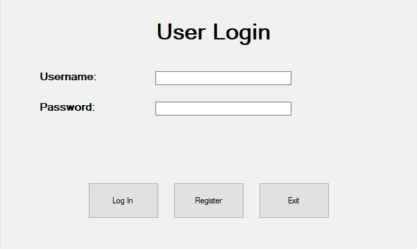
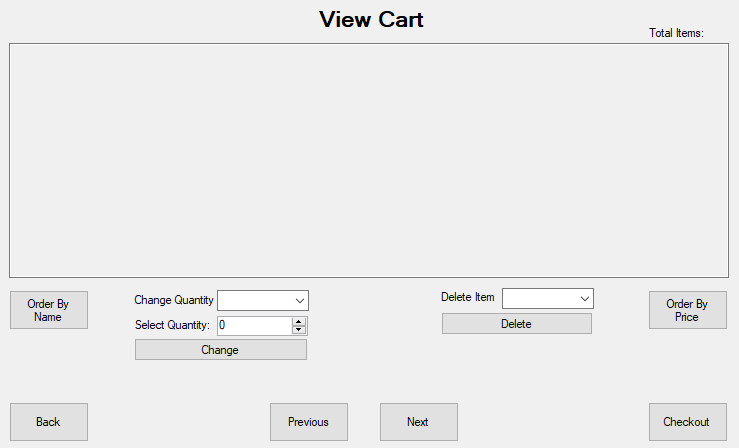
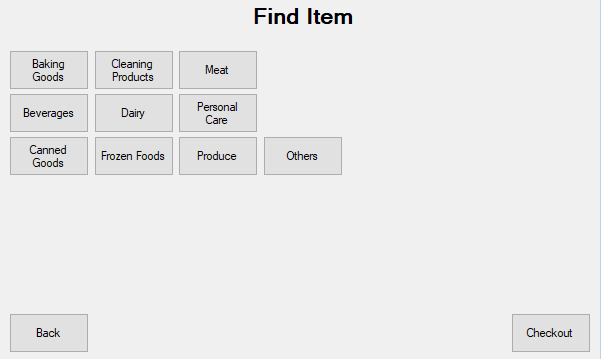
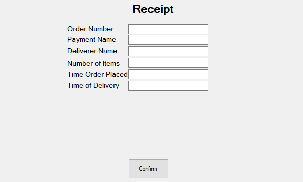

  
  <h2 align="center">GroceryBama</h2>
  
a grocery-to-home delivery service for GroceryBama.com

  

    
    
  

This project was designed to be a real world application for the material from the course **Database Management Systems** at Alabama. This course, CS 300, consists of ...

## Basic Idea
This application automates the process from shoopping to delivering at grocery stores. There are 3 main user types: buyers, deliverers, and managers. ***Buyers*** have the ability to search different grocery stores, find items, then purchase items. ***Deliverers*** have assigned orders including items, address, and other important information from the buyer. They are to complete each assignment and update the database. Lastly, ***managers*** are connected to a store where they can view its inventory, orders, and the revenue report.

## Back-End
> The back-end for this software is programmed using SQL along with tools including Windows SQL Server and phpMyAdmin for testing. View the create table file <a href="./src/GroceryBama.sql">here</a>.

| Table | Attributes |
| --- | --- |
| Address | <kbd style="color: #00bfff">id</kbd> <kbd>house_number</kbd> <kbd>street</kbd> <kbd>city</kbd> <kbd>state</kbd> <kbd>zip_code</kbd> |
| Buyer | <kbd style="color: #00bfff">username</kbd> <kbd>phone</kbd> <kbd>address_id</kbd> <kbd>default_payment</kbd> <kbd>default_store_id</kbd> |
| deliveredBy | <kbd style="color: #00bfff">order_id</kbd> <kbd>deliverer_username</kbd> <kbd>is_delivered</kbd> <kbd>delivery_time</kbd> <kbd>delivery_date</kbd>
| GroceryStore | <kbd style="color: #00bfff">store_id</kbd> <kbd>store_name</kbd> <kbd>address_id</kbd> <kbd>opening_time</kbd> <kbd>closing_time</kbd> <kbd>phone</kbd> |
| Item | <kbd style="color: #00bfff">item_id</kbd> <kbd>item_name</kbd> <kbd>food_group</kbd> <kbd>exp_date</kbd> <kbd>quantity</kbd> <kbd>listed_price</kbd> <kbd>wholesale_price</kbd> <kbd>description</kbd> |
| orderedBy | <kbd style="color: #00bfff">order_id</kbd> <kbd>buyer_username</kbd> |
| orderFrom | <kbd>store_address_id</kbd> <kbd style="color: #00bfff">order_id</kbd>
| Orderr | <kbd style="color: #00bfff">order_id</kbd> <kbd>delivery_instructions</kbd> <kbd>delivery_time</kbd> <kbd>order_palced_date</kbd> <kbd>order_placed_time</kbd> |
| Payments | <kbd style="color: #00bfff">username</kbd> <kbd>payment_name</kbd> <kbd>account_number</kbd> <kbd>routing_number</kbd> |
| manages | <kbd style="color: #00bfff">username</kbd> <kbd>store_address</kbd> |
| selectItem | <kbd style="color: #00bfff">item_id</kbd> <kbd>quantity</kbd> <kbd>order_id</kbd> |
| soldAt | <kbd style="color: #00bfff">item_id</kbd> <kbd style="color: #00bfff">store_id</kbd> |
| Userr | <kbd style="color: #00bfff">username</kbd> <kbd>password</kbd> <kbd>user_type</kbd> <kbd>email</kbd> <kbd>first_name</kbd> <kbd>last_name</kbd> |
| SystemInformation | <kbd style="color: #00bfff">system_id</kbd> <kbd>user_codes</kbd> | 

## Front-End
> The front-end code for this application is programmed using C#

  
  
  
  

## Installation
to be added...